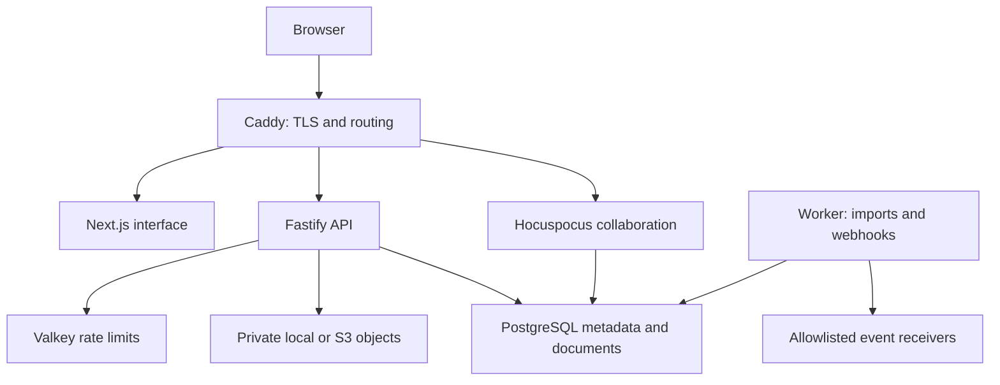

# Architecture and boundaries

## Runtime

All authoritative state belongs to PostgreSQL and private object storage. Valkey is disposable rate-limit state. Jobs and event delivery use PostgreSQL locks and an outbox rather than a second durable queue. A stopped worker does not lose pending jobs or events.

## Tenant and resource model

An organisation is the tenant. Workspaces contain spaces; spaces and pages contain pages and databases; database records are resources with their own full document body. Composite tenant/resource foreign keys prohibit cross-tenant parent references. Domain operations hold a transaction-level tree lock and reject cycles or invalid parent kinds.

Every tenant operation runs in a database transaction with `SET LOCAL ROLE workspace_app` and transaction-local `app.tenant_id`. Tenant tables use forced row-level security. Production API, worker and collaboration processes receive only the `workspace_runtime` login; the migration/operations jobs receive the owner connection. Owner credentials are not passed to the web, API, collaboration or worker containers.

Users and hashed sessions are global authentication infrastructure. Narrow `SECURITY DEFINER` functions resolve a session, a user's organisations, an invitation or tenant IDs for the worker. Their search paths are fixed and public execution is revoked. They do not return tenant content. The runtime database role is trusted application infrastructure, not a customer-facing SQL credential. RLS enforces tenant boundaries; resource ACLs remain an application policy checked on each access channel.

## Permission rules

Levels: 0 no access, 1 view, 2 comment, 3 edit, 4 manage. Owners and administrators manage every resource in their organisation. Members start at edit. Guests and integration principals start at no access.

The evaluator walks root to leaf. A local user grant overrides an everyone grant. Disabling inheritance resets the level before local grants apply. Any ancestor that evaluates to no access blocks the entire subtree, even if a descendant grants access. A guest therefore needs an explicit grant at the workspace root and at any restricted ancestor. A parent with view access may grant higher access on an allowed child; only a zero level is a hard subtree boundary.

Soft-deleted resources and descendants of deleted parents are inaccessible through normal reads. Trash listing explicitly evaluates the ACL while including deleted ancestors. Restore requires a live, editable parent.

The API, search, file downloads, database queries, exports, imports and collaboration connections all call the same policy evaluator. Session activity and permissions are rechecked for live collaboration messages and by a periodic one-second connection sweep. An import rechecks active membership and the destination permission when it executes. Integration responses should never be treated as permanently authorized evidence: recheck end-user access when presenting it.

## Document persistence and restore

`page_documents` stores the authoritative Yjs state alongside canonical block JSON, searchable text, revision and epoch. The editor loads the existing Yjs bytes, not a newly generated document from JSON. That preserves collaborative identity across reconnects.

The collaboration service validates incoming projected blocks before broadcasting them. It stores Yjs bytes, block JSON, text, updated resource metadata, audit and outbox event in one transaction. Only after commit does it broadcast a `persisted` message containing a Yjs snapshot. The client compares full snapshots, including deletion state, before displaying **Saved**. Disconnected or failed persistence states never display Saved. Changes are not durable on the local device while offline; keep the tab open until reconnection and a save acknowledgement.

REST replacements and history restores require an expected revision. They save the previous content, increment the revision and advance the epoch. Old rooms cannot overwrite a restored document. Clients are reset into a new room after a restore.

A PostgreSQL advisory lock enforces one collaboration writer for the entire deployment. Do not horizontally scale this service until a distributed shared-document design and its failure tests have been implemented. Autosave history checkpoints are coalesced to one per five minutes per page; explicit replacements always produce checkpoints.

## Structured databases

Schemas use stable property IDs and one title property. Supported types are Title, Text, Number, Select, MultiSelect, Status, Date, Checkbox, Person, URL and Email. Writes validate both type and option membership; Person fields require an active organisation member. Database schema changes are checked against existing values.

Records use revision preconditions. Table/board views save configuration in PostgreSQL, including filters, sort, visibility, widths, order and grouping. Board drag and drop uses the same record update path as table editing; a Status selector is available for keyboard use. List queries are parameterized. This first pass caps each page of records at 200 and each synchronous export at 10,000 rows.

## Authentication and private files

Passwords use scrypt with a per-password salt. Human session tokens and service credentials are random opaque tokens; only their SHA-256 digests are stored. Human sessions expire after 12 hours; service credentials after 90 days. Mutating cookie requests require a session-bound CSRF token and, when present, the configured origin. Cookies are HttpOnly, SameSite=Lax, and Secure for HTTPS deployments. Invitations are single-use and expire after seven days. Existing accounts must prove their existing password when accepting an invitation.

Files are restricted to a known extension/MIME allowlist and checked for expected signatures where applicable. File keys contain tenant/resource/file IDs. Downloads recheck the parent ACL, set nosniff and a sandbox policy, and use attachment disposition for non-images. Raw object storage is not public. There is no malware scanner in this first pass.

## Events and failure handling

Mutations append minimal versioned event references in the same transaction as state. The worker creates unique deliveries per subscription and event. Receivers must deduplicate by event ID because delivery is at least once. HMAC covers the timestamp and exact request body. Secrets are encrypted using AES-256-GCM with the deployment encryption key. Destinations require an exact administrator-configured origin allowlist. Redirects are not followed; responses and timeouts are bounded.

Retry delay is exponential, capped at one hour; the eighth failed attempt is marked dead. Delivery calls currently hold a database transaction while waiting for the receiver. This is intentionally simple and needs lease-based delivery before heavy production volume. Database audit records are append-only to the application role, but a database owner can change them; use external immutable audit archival where required.

## White label and licensing

Brand defaults live in `packages/branding`. Organisation overrides are runtime data. Sign-in branding comes from deployment environment variables because the user has not selected an organisation yet. No fork of BlockNote is maintained. Core packages are used as unmodified dependencies and no XL package is installed. See the preserved notices and source links in the license inventory.
